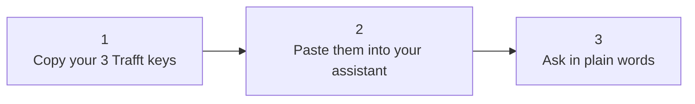
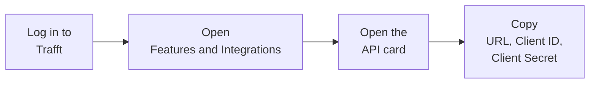
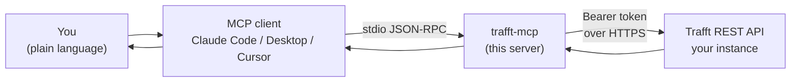
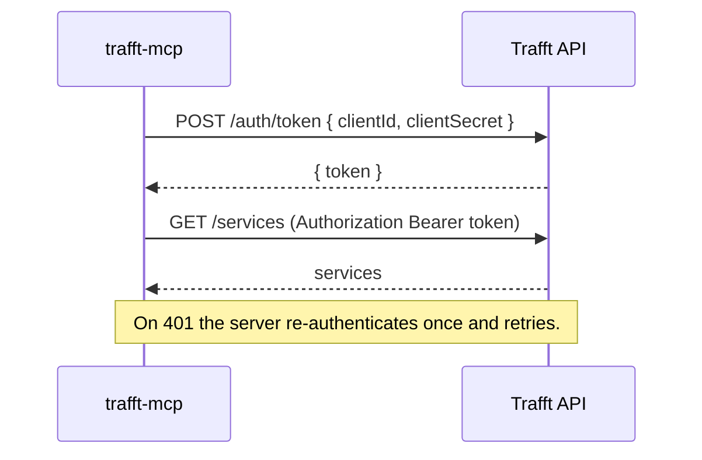

<p align="center">
  
</p>

<h1 align="center">trafft-mcp</h1>

<p align="center">
  Talk to your <a href="https://trafft.com">Trafft</a> booking calendar in plain language, from any AI assistant.
</p>

<p align="center">
  
  
  
  
  
</p>

> **Not affiliated with Trafft.** This is a free, community-built bridge. Trafft and the Trafft logo are trademarks of their owner, and all credit for the booking platform and its API goes to Trafft. This project lets an AI assistant talk to that API for you. Full detail in [docs/LICENSING.md](docs/LICENSING.md).

## What it is, in one line

Trafft runs your bookings. This connects your AI assistant to Trafft so you can manage it all by asking.

## Quick start in 3 steps



1. **Copy your 3 keys** from Trafft. Jump to [Where to find your credentials](#where-to-find-your-credentials). You need an API URL, a Client ID, and a Client Secret.
2. **Paste them in** following [Install](#install). It is copy and paste, nothing to write.
3. **Ask in plain words.** That is the whole workflow. Examples below.

## What you can ask

Once it is connected, you talk to your assistant normally and it acts on your real Trafft account.

- "What appointments do I have next week?"
- "Book a strategy session for Sarah on Monday at 2pm."
- "Which slots are free for a consultation this Friday?"
- "Add a new customer, Max, max@example.com."
- "Show me every coupon and how many times it was used."

No code. No dashboards. No clicking through screens.

## Where to find your credentials

You need three values from your own Trafft account. Here is exactly where they live.



1. Log in to your Trafft admin dashboard.
2. Open **Features and Integrations** in the left sidebar.
3. Find the **API** card. If it shows **Enable**, click that first, then **Set Up**. If it is already on, click **Set Up**.
4. The page shows your **API URL**, **Client ID**, and **Client Secret**. Copy all three.

Then map each value to a setting.

| What you copied in Trafft | Where it goes | Looks like |
|---|---|---|
| API URL | `TRAFFT_API_URL` | https://yoursubdomain.trafft.com |
| Client ID | `TRAFFT_CLIENT_ID` | a long string of letters and numbers |
| Client Secret | `TRAFFT_CLIENT_SECRET` | a longer string of letters and numbers |

The API URL is the full web address of your Trafft, with no slash at the end. On a normal cloud account it looks like `https://yoursubdomain.trafft.com`. On a white-label or self-hosted account it is your own domain, for example `https://booking.yourcompany.com`. Use whatever the API card shows you.

> The Trafft API comes with the Agency tier and above. If the API card is missing, your plan may not include it yet.

## Install

```bash
git clone https://github.com/mjmirza/trafft-mcp.git
cd trafft-mcp
npm install
npm run build
```

Add your credentials.

```bash
cp .env.example .env
# open .env and paste your three values
```

Your `.env` is private. It is gitignored, never committed, and never leaves your machine.

Connect your assistant.

<details>
<summary><b>Claude Code (command line)</b></summary>

```bash
claude mcp add trafft \
  --command node \
  --args /absolute/path/to/trafft-mcp/build/index.js \
  --env TRAFFT_API_URL=https://yoursubdomain.trafft.com \
  --env TRAFFT_CLIENT_ID=your_client_id \
  --env TRAFFT_CLIENT_SECRET=your_client_secret

claude mcp list   # trafft should show as connected
```
</details>

<details>
<summary><b>Claude Desktop, Cursor, and other clients</b></summary>

Add this to the client's MCP config file (`claude_desktop_config.json`, `.cursor/mcp.json`, or equivalent), then restart the client.

```json
{
  "mcpServers": {
    "trafft": {
      "command": "node",
      "args": ["/absolute/path/to/trafft-mcp/build/index.js"],
      "env": {
        "TRAFFT_API_URL": "https://yoursubdomain.trafft.com",
        "TRAFFT_CLIENT_ID": "your_client_id",
        "TRAFFT_CLIENT_SECRET": "your_client_secret"
      }
    }
  }
}
```

Use the absolute path to `build/index.js`.
</details>

## For developers

<details>
<summary><b>How it works</b></summary>

`trafft-mcp` is a [Model Context Protocol](https://modelcontextprotocol.io) server. It wraps the Trafft REST API and exposes it as MCP tools over stdio. Any MCP client spawns it and calls those tools during a session.



Authentication is a token exchange. The server trades your client credentials for a Bearer token, sends it on every call, and refreshes it automatically if it expires.



| Property | Value |
|---|---|
| Language | TypeScript |
| Runtime | Node 18 or newer |
| Transport | stdio (JSON-RPC) |
| SDK | @modelcontextprotocol/sdk |
| Auth | Bearer token from client credentials, refreshed on 401 |
| Tools | 20 across 8 domains |
| Works with | Trafft cloud, self-hosted, white-label, and reseller client accounts |

</details>

<details>
<summary><b>All 20 tools</b></summary>

| Tool | What it does |
|---|---|
| `list_customers` | List customers, with optional search and paging |
| `get_customer` | Fetch one customer by id |
| `create_customer` | Add a new customer |
| `update_customer` | Change fields on a customer |
| `delete_customer` | Remove a customer (destructive) |
| `list_employees` | List staff members |
| `get_employee` | Fetch one employee, with assigned services |
| `list_locations` | List locations (needs Multiple Locations) |
| `get_location` | Fetch one location |
| `list_services` | List bookable services, durations, and prices |
| `get_service` | Fetch one service |
| `get_available_times` | Open slots for a service on a date |
| `list_appointments` | List appointments, filtered by date, staff, service, customer, status |
| `get_appointment` | Fetch one appointment |
| `cancel_appointment` | Cancel an appointment (destructive) |
| `create_booking` | Create an appointment for a new or existing customer |
| `list_coupons` | List coupons and usage (needs Coupons) |
| `create_coupon` | Create a discount coupon |
| `delete_coupon` | Remove a coupon (destructive) |

See [docs/API.md](docs/API.md) for the full endpoint reference.

</details>

## Built to use few tokens

Every result an AI assistant reads costs tokens. This server stays small by default.

- Compact responses, never pretty-printed. That alone roughly halves the size.
- Empty fields are stripped from every response.
- A hard size cap protects the assistant from a flood. One big list can never overwhelm it. Tunable with `TRAFFT_MAX_RESPONSE_CHARS` (default `20000`).
- List tools return a small page by default, so broad questions stay small until you ask for more.

## Check that it works

A built-in auditor confirms that login works and that every endpoint actually responds.

```bash
npm run audit        # read only. logs in and probes every endpoint
npm run audit:deep   # also creates a throwaway test record and cleans it up
```

It also maps which endpoints your account exposes, so you can see exactly what is available on your plan. A scheduled copy runs monthly in CI and opens an issue if anything breaks. Add your three keys as repository secrets to turn it on.

## White-label, self-hosted, and reseller accounts

This works whether your Trafft is on the cloud, on your own domain, or on a white-label or reseller client account, because you give it the full base URL rather than a fixed subdomain. Point `TRAFFT_API_URL` at whatever your API card shows. If your instance uses a different API version path, set `TRAFFT_API_PATH` (default `/api/v1`).

<details>
<summary><b>What the API does not cover</b></summary>

The Trafft API is in beta and does not expose the whole portal. These have no public API today, so they cannot be controlled here.

- Employee working hours and schedules
- Payments, refunds, and invoices
- Service extras (add-ons)

Free-slot results still respect all schedule rules, because Trafft applies them on its side. Run `npm run audit` to see the true, current surface of your own instance.

</details>

## Contributing

This repository keeps a hard quality gate so it does not collect technical debt. Every push and pull request must compile cleanly and pass [Fallow](https://fallow.tools) with zero dead code. Work on a branch, open a pull request, let CI pass, then merge.

## Connect and support

Built and maintained by Mirza Iqbal (Skayel Ltd, [next8n](https://next8n.com)). One click to follow.

<p align="center">
  <a href="https://github.com/mjmirza"></a>
  <a href="https://www.linkedin.com/in/mirzajhanzaib/"></a>
  <a href="https://www.youtube.com/@mirzaiqbal"></a>
  <a href="https://x.com/MirzaJhanzaib"></a>
  <a href="https://next8n.com"></a>
  <a href="https://github.com/sponsors/mjmirza"></a>
</p>

If this saves you time, a few small things help a lot.

- Star this repository so more Trafft users can find it.
- Follow on any platform above. One click each.
- If it earns its keep, consider [sponsoring](https://github.com/sponsors/mjmirza). Sponsorship funds the upkeep and the monthly endpoint checks.

Thank you for using it and for sharing it.

## License and trademarks

Released under the [MIT License](LICENSE). Free to use, copy, modify, and distribute.

Trafft and the Trafft logo are trademarks of their owner. This project is independent and not affiliated with, endorsed by, or sponsored by Trafft. The logo appears here under nominative fair use to identify the platform this tool connects to. Full evaluation in [docs/LICENSING.md](docs/LICENSING.md).
